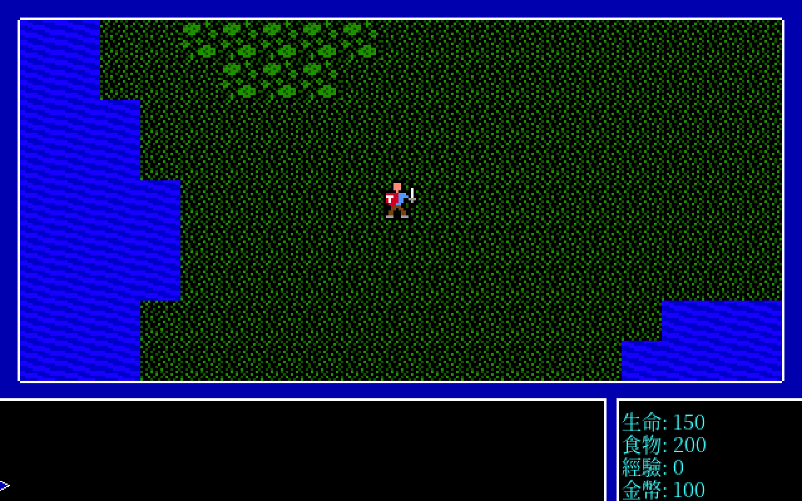
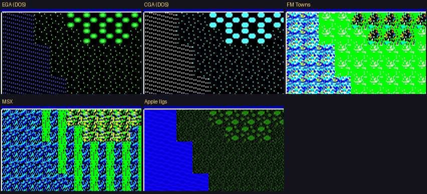

# 創世紀 I:黑暗紀元 — 繁體中文化

> Ultima I: The First Age of Darkness — 一切角色扮演遊戲的起點，現在能用母語走進索薩利亞。

基於 [`matiaslaino/open_ultima`](https://github.com/matiaslaino/open_ultima)(C++17 / SDL2，MIT 授權)的開源重製，
加上繁體中文化、Linux 移植、功能補完，以及一個別處沒有的彩蛋——**七種平台的原汁原味畫面，一鍵切換**。



---

## 一封寫給索薩利亞的信

1981 年，一個叫 Richard Garriott 的德州大學生，把自己畫在方格紙上的地下城搬進 Apple II，
署名 **Lord British**。那捲磁碟片後來有了名字:《Ultima》。電腦角色扮演遊戲這個類型，從這裡開始。

台灣玩家叫它《創世紀》。我們玩過四代、六代、七代——靠著《電腦玩家》《軟體世界》《PC Game》三大誌
逐字翻譯的手冊，在十四吋 CRT 前面熬夜。但**第一代，那顆種子本身，幾乎沒有人玩過中文版**。

這個 repo 不是商品，是一封遲到四十年的回信。汝若也記得那個沒有攻略網站、只有雜誌與 BBS 的年代，
歡迎回到索薩利亞。

---

## 目錄

- [這是什麼遊戲](#what)
- [七種畫面，一個世界](#tilesets)
- [已經做好的](#done)
- [操作與快速鍵](#keys)
- [譯名小考](#names)
- [建置・執行・測試](#build)
- [文件索引](#docs)
- [致謝與授權](#credits)

---

<a name="what"></a>
## 這是什麼遊戲

索薩利亞(Sosaria)有四塊大陸，由仁君 Lord British 治理。黑暗從一名叫 **蒙登(Mondain)** 的巫師而來——
他打造了一顆「不朽寶石」，只要儀式完成，他將永生、無人能敵。汝扮演一名從異世界跌進來的陌生人，
要在他得手之前練強自己、攢齊裝備，找到那台**時光機**，回到過去，趁他尚未不朽時一劍了結。

最瘋的地方在這裡:這是一款 1981 年的奇幻 RPG，**卻會突然切換成太空射擊**。
為了取得時光機的駕駛資格，汝得駕駛太空梭升空，在星海裡打一場 TIE 戰機式的纏鬥拿到軍階。
劍與魔法、地城與城鎮，中間插一段星際大戰——這種混搭，當年沒人敢這樣做，後來也很少有人複製。

> open_ultima 上游仍是極早期重製:世界地圖、基礎地牢、地面戰鬥已能跑;城鎮與完整法術系統還在路上。
> 本專案在這個骨架上做中文化與功能補完，逐步對齊原版 1981 的行為(例如地面怪物「出現即攻擊、不移動」——
> 這是考據自 1983 Atari 版反組譯與當年資料的結論，見 [`docs/ultima1-original-ai.md`](docs/ultima1-original-ai.md))。

---

<a name="tilesets"></a>
## 七種畫面，一個世界

《創世紀 I》四十年來被移植到十幾種機器，每一台的美術都是當年工程師重畫的。我們把這些版本的圖素
一張一張抽回來、對齊到引擎的 52 格 tile，做成可熱鍵切換的素材包——**同一張索薩利亞地圖，七種時代的眼睛**。



| 版本 | 來源 | 風味 |
|---|---|---|
| **EGA**(DOS) | `EGATILES.BIN`，RowPlanar 4bpp | 1987 PC 上多數人記得的 16 色面孔 |
| **CGA**(DOS) | `CGATILES.BIN`，Linear 2bpp | 青、洋紅、白——四色機的倔強 |
| **FM Towns** | Trilogy CD 抽出，8 色高彩 | 日系移植的亮綠草原 |
| **MSX** | `.dsk` 反組譯 OUT.COM 破解格式 | SCREEN 7 點陣的東洋骨架 |
| **PC-98** | `.fdi` 取出 `EGCTILES.BIN`,破解 32×32 4-plane planar | 純飽和 RGB、32×32 高解析的日系重繪 |
| **Apple IIgs** | 1994 Vitesse 版 woz 反組譯、LZSS 解壓原始圖檔 | 由《異星搜奇》團隊重繪、如今近乎絕跡的決定版 |
| **Atari 8-bit** | 1983 ATR 反組譯 OUTMOVE、$6400 1bpp charset | 黑底橄欖綠與藍，家用電腦草創期的素樸 |

最後一個值得多說一句。1994 年，曾主導《Bard's Tale III》的 Rebecca Heineman 重組班底，
為 Apple IIgs 重畫了全套高解析美術、配上 synthLAB 音樂，做出公認畫面最強的《創世紀 I》。
可惜發行商不久後倒閉，這個版本極其稀有，網路上乾淨截圖屈指可數。
我們把它的圖檔從原始壓縮資料一格一格解了出來——上面那張開場圖的水波與草地，是原汁原味的 IIgs 像素本人。

而這個版本的圖檔藏在一種從無公開文件的自訂壓縮格式裡。我們把它的程式從一張 woz 磁碟一路逆向，
**反組譯 65816 機器碼、在程式裡直接讀出它的解壓演算法**(原來是 LZSS),完全破解;
最後再用實機截圖當對照、反推出整套地形與人物 tile 的確切位置,把全 52 格原汁原味的 IIgs 像素一格不差地取出來。
全程紀錄成一個獨立章節:**[📖 Apple IIgs 逆向工程全紀錄](docs/re/apple-iigs-reverse-engineering.md)**。

> 切換方式:`F1` / `PageDown` 循環 EGA → CGA → 各平台素材包(FM Towns → MSX → Apple IIgs → PC-98 → Atari → VGA),畫面即時換臉、不需重開。

---

<a name="done"></a>
## 已經做好的

- **全畫面繁體中文**:世界地圖訊息、狀態列(生命／食物／經驗／金幣)、戰鬥、敵人名稱，全程 UTF-8 管線。
- **內部畫布拉到 640**:底圖用 nearest 整數放大保持銳利，中文用 16px 不糊成一團。
- **宋體抗鋸齒**:Noto Serif CJK，1280×800 乾淨 2× 縮放。
- **離開鐵則**:`F10` / `Ctrl+Q` 跳置中中文確認框，`ESC` 永遠是取消——不會手滑噴掉進度。
- **多版素材包熱鍵切換**:見上一章;`F1` 逐一循環全部平台包,切換不再讓 NPC 消失(這個雷 u4-cht 踩過)。
- **音樂跟隨平台**:`F1` 切到哪一版畫面，背景音樂就換成那一版的原版 BGM。**MSX / PC-98 / FM Towns 三版已原生還原**——逆向各自的音樂序列格式(MCP / SCORE / EUPHONY，同一作曲團隊)，用自寫 2-op FM 合成器轉回 ogg，**完全不跑模擬器**。Atari/DOS 原版無地圖 BGM、IIgs 僅音效(考證見下)。缺檔自動退回占位曲，`M` 鍵開關。完整逆向與還原步驟見 [`docs/music.md`](docs/music.md)。
- **完整 RPG 迴路(上游沒有的補完)**:從「城鎮空殼 + 固定傷害」做到可通關的遊戲——
  - **商店**:進城鎮 `B` 買武器/防具/食物/法術,酒館聽線索(物品欄 + 裝備 + 存檔)。
  - **戰鬥深度**:傷害接武器/防具/屬性,擊殺得經驗 → 升級回滿 + 上限成長,死亡回 Lord British 城堡復活。
  - **國王試煉**:城堡 `T` 晉見國王領任務(討伐 N 隻惡徒 → 金幣 + 力量),完成 4 位國王試煉解鎖終局。
  - **魔法**:魔法店買法術,地牢 `C` 施放(魔法飛彈/致死術/升降梯/祈禱)。
  - **角色屬性表**:`Z` 一頁看等級/六屬性/裝備/任務進度。
  - **勝利結局**:歷練足夠後終結蒙登、駕時光機重歸光明——上游沒有 win condition,本作補上完整結局。
- **存檔系統**:`F10` 離開自動存檔、`F5` 手動、啟動自動載入(玩家狀態 + 物品欄 + 設定全持久化)。
- **回合制生怪 + 怪物 AI**:`speed_pct` / `spawn_pct` 可調;地面怪忠於 1981(出現即攻擊、不移動),F6 可選開啟貪婪追蹤。
- **跨平台逆向考據**:MSX、Apple IIgs、各版音樂格式破解 等完整經驗都寫進了 `docs/re/` 與 `docs/music.md`,可重跑的方法。

---

<a name="keys"></a>
## 操作與快速鍵

| 鍵 | 作用 |
|---|---|
| 方向鍵 | 在世界地圖移動(指令列顯示「東／南／西／北」) |
| `F1` / `PageDown` | 循環切換 tileset(EGA / CGA / FM Towns / MSX / Apple IIgs / PC-98 / Atari / VGA) |
| `B` / `T` | 城鎮商店買賣 / 城堡晉見國王(任務) |
| `C` / `Z` | 地牢施放法術 / 角色屬性表 |
| `F5` / `F9` | 手動存檔 / 音效開關 |
| `F6` | 設定選單:時間流速 / 生怪率 / 野外怪物追蹤 |
| `M` | 音樂開／關(背景音樂隨 `F1` 平台切換) |
| `F10` / `Ctrl+Q` | 離開(跳確認框,`Y`/`Enter` 確定,`N`/`ESC` 取消) |

完整對照與實作進度見 [`docs/keybindings.md`](docs/keybindings.md)。

---

<a name="names"></a>
## 譯名小考

老遊戲漢化最怕的不是看不懂，是「當年就翻錯、大家也記住了」。索薩利亞、Lord British、蒙登這些名字，
台灣三大誌與後續幾代《創世紀》中文化各有譯法。本專案的原則是**還原而非批判**:先查 1980 年代的譯名脈絡，
再決定沿用或調整，並把理由留在 [`docs/localization-notes.md`](docs/localization-notes.md)。
人物對白採古英文倒譯的語氣(「汝」「卿」)，對齊原版手冊那種中世紀羊皮紙腔。

---

<a name="build"></a>
## 建置・執行・測試

一律走 Docker，不污染本機環境。

```bash
# 建置
docker build -t u1-cht docker/
docker run --rm -v "$PWD":/work -w /work u1-cht \
  bash -c "cmake -S . -B build && cmake --build build -j"
```

**執行需求**

- SDL2 / SDL2_image / SDL2_ttf / SDL2_gfx / SDL2_mixer、nlohmann/json(Docker 內已備)。
- **原始遊戲資料檔**(版權，使用者自備，來自 GOG 版 U1):放入 `gamedata/`。
- `config.json`(複製 `config.json.example` 調路徑;可調 `speed_pct` / `spawn_pct` / `tileset`)。

**測試(game tester)**

```bash
docker run --rm -v "$PWD":/work -w /work u1-cht bash tools/game_tester.sh
# 在 xvfb 下驅動正常玩家路徑(移動／切 tileset／音樂／離開)，逐步截圖到 tests/snapshots/out/
```

---

<a name="docs"></a>
## 文件索引

| 文件 | 內容 |
|---|---|
| [`PLAN.md`](PLAN.md) | 執行計畫、階段拆解、技術堆疊 |
| [`CONTEXT.md`](CONTEXT.md) | 專案語彙(glossary)、上游現況、硬規則 |
| [`WORKLIST.md`](WORKLIST.md) | 進度追蹤(已完成／排程／跨平台素材包) |
| [`docs/keybindings.md`](docs/keybindings.md) | 操作介面與快速鍵 |
| [`docs/plan-town-combat.md`](docs/plan-town-combat.md) | 城鎮內容 + 戰鬥深度的實作規劃(資料確認 + 分階段) |
| [`docs/ultima1-original-ai.md`](docs/ultima1-original-ai.md) | 原版 U1(1981)怪物 AI 考據 + 出處 |
| [`docs/localization-notes.md`](docs/localization-notes.md) | 中文化技術筆記(字型管線、拉畫布決策) |
| [`docs/materials.md`](docs/materials.md) | 各平台素材來源清單(DOS／MSX／PC98／FM Towns／IIgs…) |
| [**`docs/music.md`**](docs/music.md) | **★ 各版本音樂逆向與原生還原**(MCP/SCORE/EUPHONY 格式破解、還原步驟、IIgs/Atari 考證) |
| [**`docs/re/apple-iigs-reverse-engineering.md`**](docs/re/apple-iigs-reverse-engineering.md) | **★ Apple IIgs 逆向工程全紀錄**(woz 抽檔 → 反組譯 65816 → 破解 LZSS 圖格式) |
| [`docs/re/`](docs/re/) | 逆向工程經驗:MSX openMSX、Apple IIgs MAME/GS-OS、6502 方法論等 |
| [`docs/adr/0001-pluggable-asset-packs.md`](docs/adr/0001-pluggable-asset-packs.md) | 可替換素材包架構決策 |

---

<a name="credits"></a>
## 致謝與授權

- **Richard Garriott(Lord British)**——1981 年那捲磁碟片，與其後四十年的索薩利亞。
- **Rebecca Heineman 與 Vitesse 團隊**——1994 Apple IIgs 決定版，畫面取自其僅存實機截圖。
- **[`matiaslaino/open_ultima`](https://github.com/matiaslaino/open_ultima)**——本專案的開源引擎基礎。
- 台灣 1990 年代《電腦玩家》《軟體世界》《PC Game》三大誌——那些手冊翻譯，是一代人的入門書。

程式碼承上游 **MIT**(見 `LICENSE.open_ultima`)。原始遊戲資料與各平台美術、音樂為原權利人版權所有，
本專案不隨附、不重新散布;素材包僅作引擎與資料分離的技術示範。
